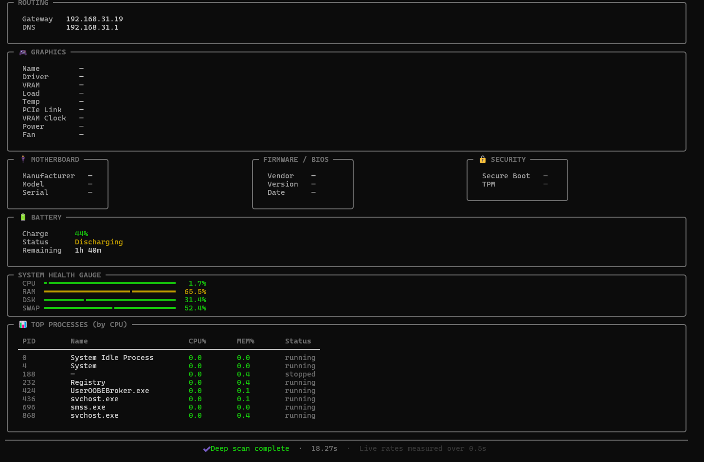

# 🖥️ ABOUT PC – Deep System Analyzer

## 📸 Screenshots




- **Deep hardware inspection**  
  - CPU: name, architecture, cores, frequency, cache, family/model/stepping, microcode version, virtualization support (VT‑x/AMD‑V)  
  - Memory: per‑slot size, type (DDR3/4/5), speed, manufacturer, part number, serial number  
  - Storage: partition usage + physical disk model, serial number, interface (NVMe/SATA), SMART health (where available)  
  - GPU: name, driver, VRAM usage, load, temperature, PCIe link speed, VRAM clock, power draw, fan speed  
  - Motherboard & BIOS: manufacturer, model, serial, BIOS version/date  
  - Security: Secure Boot status, TPM presence  

- **Live throughput metrics** (measured during the scan)  
  - Real‑time network upload / download rates  
  - Real‑time disk read / write rates  
  - CPU frequency change (delta)  

- **Premium terminal UI**  
  - Rounded panels, emoji icons, gradient title, color‑coded health gauges  
  - Per‑core CPU usage bars  
  - Top processes table (by CPU)  
  - Fully responsive, works on Windows, Linux, macOS  

- **Cross‑platform** – uses `psutil` and native commands (WMIC on Windows, `/proc` on Linux, sysctl on macOS)  

## 📦 Requirements

- Python 3.6 or higher  
- Python packages:  
  - [`psutil`](https://pypi.org/project/psutil/) (system information)  
  - [`rich`](https://pypi.org/project/rich/) (terminal styling)  
- Optional: [`GPUtil`](https://pypi.org/project/GPUtil/) for detailed GPU stats (falls back gracefully)  
- **Linux users**: for full memory slot details you may need `sudo` access (the script will try `dmidecode`).  
- **Windows users**: no extra privileges required – uses WMI via `wmic` (built‑in).  

## 🚀 Installation

1. **Clone the repository** (or just download `index.py`)
   ```bash
   git clone https://github.com/deathkernel/aboutpc.git
   cd aboutpc"# aboutPC" 
