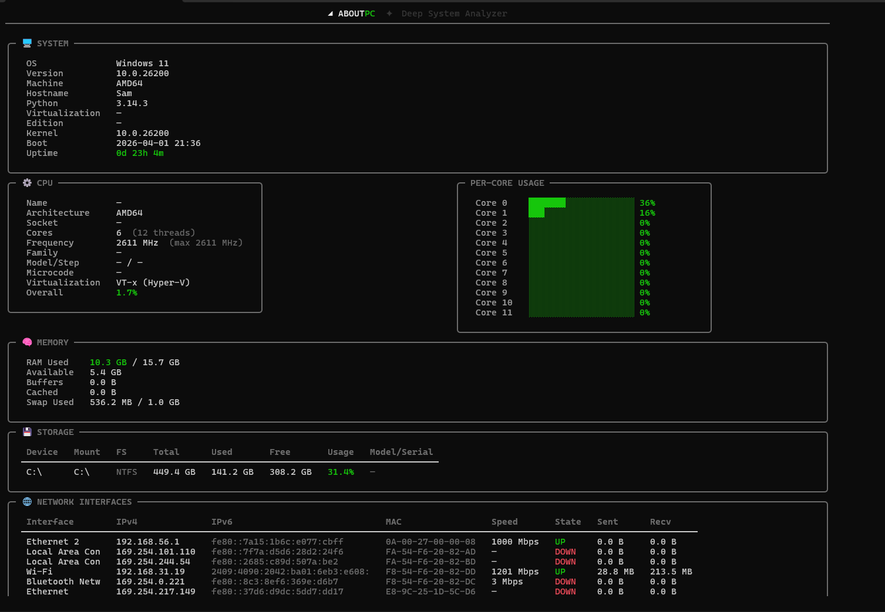

# 🖥️ ABOUT PC – Deep System Analyzer

[](https://python.org)
[](LICENSE)
[]()


## 📸 Screenshots


*Main dashboard showing system overview, CPU and memory details*


*Deep hardware inspection – memory slots, storage, GPU, and live network rates*

## ✨ Features

### 🔍 Deep Hardware Inspection
- **CPU** – name, architecture, cores, frequency, cache, family/model/stepping, microcode version, virtualization support (VT‑x/AMD‑V)  
- **Memory** – per‑slot size, type (DDR3/4/5), speed, manufacturer, part number, serial number  
- **Storage** – partition usage + physical disk model, serial number, interface (NVMe/SATA), SMART health (where available)  
- **GPU** – name, driver, VRAM usage, load, temperature, PCIe link speed, VRAM clock, power draw, fan speed  
- **Motherboard & BIOS** – manufacturer, model, serial, BIOS version/date  
- **Security** – Secure Boot status, TPM presence  

### ⏱️ Live Throughput Metrics
- Real‑time network upload / download rates  
- Real‑time disk read / write rates  
- CPU frequency change (delta)  

### 🎨 Premium Terminal UI
- Rounded panels, emoji icons, gradient title, color‑coded health gauges  
- Per‑core CPU usage bars  
- Top processes table (by CPU)  
- Fully responsive – works on Windows, Linux, macOS  

### 🌍 Cross‑Platform
Uses `psutil` and native commands:
- **Windows** – WMI (`wmic`)  
- **Linux** – `/proc`, `sysfs`, `dmidecode` (optional)  
- **macOS** – `sysctl`, `system_profiler`  

## 📦 Requirements

- **Python** 3.6 or higher  
- **Python packages**:  
  - [`psutil`](https://pypi.org/project/psutil/) (system information)  
  - [`rich`](https://pypi.org/project/rich/) (terminal styling)  
- **Optional**: [`GPUtil`](https://pypi.org/project/GPUtil/) for detailed GPU stats (falls back gracefully)  
- **Linux users**: for full memory slot details you may need `sudo` access (the script will try `dmidecode`).  
- **Windows users**: no extra privileges required – uses built‑in WMI.  

## 🚀 Installation

### From source (recommended)

```bash
git clone https://github.com/deathkernel/aboutpc.git
cd aboutpc
pip install -r requirements.txt   # or manually: pip install psutil rich
python index.py